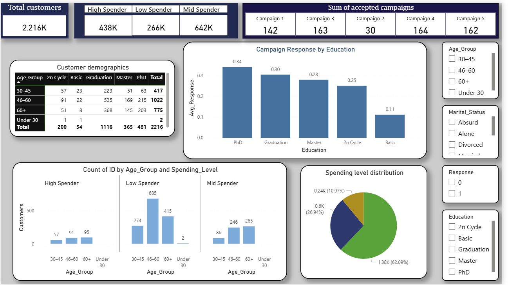

# 📊 Power BI Dashboards

This folder contains interactive Power BI dashboards for analyzing **customer marketing performance** based on the cleaned dataset.  

---

## 📂 Files
- `customer_marketing visuals.pbix` → Main interactive Power BI dashboard  
- `screenshot.png` → Preview of the dashboard  

---

## 🖼 Dashboard Preview  
Here’s a quick look at the dashboard:  

---

## 📈 Key Insights
- **Customer Segmentation** → By Age, Income, and Spending Level  
- **Campaign Performance** → Acceptance rates across Campaigns 1–5  
- **Top Spenders** → Identifies the highest spenders in the dataset  
- **Recency & Engagement** → Analyzes customer activity and purchase recency  

---

## ▶️ How to Use
1. Open `customer_marketing visuals.pbix` in **Power BI Desktop**.  
2. Connect the dashboard to your local SQL database or the CSV in `/data/processed/`.  
3. Refresh the dataset and explore the visualizations with filters and slicers.  

---

## 📌 Notes
- Make sure **Power BI Desktop** is installed on your system.  
- If connecting to SQL, verify your database credentials and paths.  
